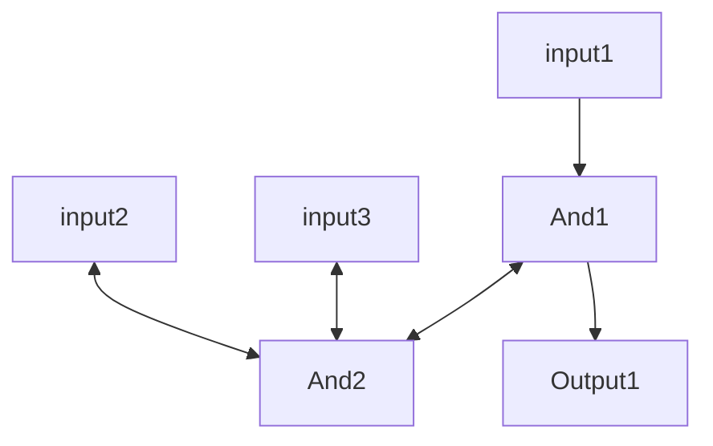
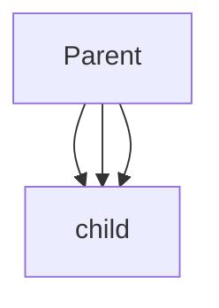

# NanoTekSpice Architecture

there are frameworks inside frameworks

## The files we read from:

input and outputs are the most basic ones.

They only have a single wire thats why its in:1

the input can only be connected to a single thing. Same thing for the output.

```
# Basic wire, direct link input to output.
#
# INPUT ---> OUTPUT

.chipsets:
input in
output out

.links:
in:1 out:1
```

but this is not all. there are also some very simple one that serve the same purpose

```
# Basic wire, direct link true to output.
#
# TRUE ---> OUTPUT

.chipsets:
true in
output out

.links:
in:1 out:1
```

however this is not all as we can also have some very complex frameworks with multiple input and outputs that have to be connected. the name does not matter, but the type (which will most likely be a class) does matter

```
# OR logic gates (4071)
#
#           +---------4071---------+
# in_01  -1-|>-+---\       ignored-|-14-
#           |  | or |-+            |
# in_02  -2-|>-+---/  |     /---+-<|-13- in_13
#           |         |  +-| or |  |
# out_03 -3-|<--------+  |  \---+-<|-12- in_12
#           |            |         |
# out_04 -4-|<--------+  +-------->|-11- out_11
#           |         |            |
# in_05  -5-|>-+---\  |  +-------->|-10- out_10
#           |  | or |-+  |         |
# in_06  -6-|>-+---/     |  /---+-<|-9-  in_09
#           |            +-| or |  |
#        -7-|-ignored       \---+-<|-8-  in_08
#           +----------------------+

.chipsets:
input in_01
input in_02
output out_03
output out_04
input in_05
input in_06
input in_08
input in_09
output out_10
output out_11
input in_12
input in_13
4071 gate

.links:
in_01:1 gate:1
in_02:1 gate:2
out_03:1 gate:3
out_04:1 gate:4
in_05:1 gate:5
in_06:1 gate:6
in_08:1 gate:8
in_09:1 gate:9
out_10:1 gate:10
out_11:1 gate:11
in_12:1 gate:12
in_13:1 gate:13
```

loop

## The user commands:

there are 5 possible commands

- exit : exits the program
- display : prints the current tick and the value of all inputs and outputs the standard output, each sorted by name in ASCII order.
- input=value : changes the value of an input. Possible value are 0, 1 and U. This also apply to clocks.
- simulate : simulate a tick of the circuit.
- loop : continuously runs the simulation (simulate, display, simulate, ...) without displaying a prompt, until SIGINT (CTRL+C) is received.

example:

```
~/B-OOP-400> cat -e or_gate.nts
.chipsets:
input   a$
input   b$
4071    or$
output  s$
.links:$
a:1     or:1$
b:1     or:2$
or:3    s:1$
~/B-OOP-400> ./nanotekspice or_gate.nts
> *b=0*
> *a=1*
> *simulate*
> *display*
tick: 1
input(s):
  a: 1
  b: 0
output(s):
  s: 1
> *exit*
~/B-OOP-400> echo $?
0
```

## Different types of components:

- special components: (these are the default, and the most used types)
    - input : a component with a single pin directly linked to the command line. Its value is initialized to undefined.
    - clock : a component that works like an input, except its value is inverted after each simulation.
    - true : a component with a single pin that is always true
    - false : a component with a single pin that is always false.
    - output : a component with a single pin used as the output of a circuit.
- The normal components: things like the 4071 that have a bunch of logic, and need things to be attached to them

## Architecture decisions: (this is all up to debate, there are the rumblings of an insane man)

since this is essentially a big graph, we shall use tree where nodes are connected to each other througfh pointers or smth similar. Every component should be a class.

On initialisation, all of them go in a big array (a map), as Icomponents?

this is done so that we can keep track of them both to delete them if necessary, but also that the user can initialse them in the cli when needed.

Everything should reside in a big class called Circuit. it should be able to add components to the map, get components, and call the simulate in the right order.

when we come across the links, we start connecting them. (theoretically tnis is done through a big parent class theat every body inherits from called Acomponent) 

The logic of every class should be self contained.

What does this mean:

- Every class only cares about itself, and the only thing it checks otherwise is if its connections are initialized correctly. example of andcomponent below alongside its parent class
- special input and special outputs are separate class. the inputs are what the user sets in the cli, and the outputs are what we display to the cli.
- inputs and outputs are truly bidirectional. meaning that in an order of execution a special input needs to be able to call  its child component, but a child component needs to be able to call a parent input (if it has 2 or more inputs for example). this simplifies the oredr of execution, because we just pick a special input at random, and we will do the rest. we do not care about infinite loops, it is the users problem to deal with. graphic explain what i mean below.



we need to define a way to check that things are being connected correctly. this means that no output should be able to connect to the output of a normal component. (on a real life component, if u started sending voltage to a place where i didn’t expect to receive it it would break) this means that we need to define types for all the classes.

now it specifically mentions in the subject that links are bidirectional, so i don’t really need to check in what order they are called do i, just that the types work together (inputs should be linked to outputs, except for special inputs. same for outputs)

about the methode which the parent get called. I have been thinking about this and i haven’t yet thought of an answer. My teacher when a component is called everything should be vcalled at once, but i am not sure how to do this without falling into any trap or uinfinite loop not intended by the user. The followingf are my ruminations on how to deal with this, and why this may not work

- child node of component gets called with the childs input pin (so that it knows who’s calling it) and the value associated with it.
    - This does not works since if the parent and children nodes share multiple inputs and output pairs the parent and child are going to be called multiple times and that may cause an infinit loop? im not sure about this

example:



- each class has a compute method with these inputs: Tristate compute(bool requesting, size_t pin, Tristate value) //when requesting, tristate is undefined, and when posting, the return value is undefinded
    - while this would remove the problem of the infinite loop,it has a problem. there are 2 different scenarios
        - It receives a reuqest = false. this means that an input is giving it a value, and it should request information to all of it inputs and post information to al of its outputs
        - It receives a request = true, it calls information from just its inputs, and only returns the output that was requesting information. Here is the problem
    - Thie means that a parent that is called by its children may never get to call its other children if it has any, meaning that part of the code may never be executed. Now you may say that this could be fixed by making sure we call all of the special inputs, but this seems to me to be simply a cheap workaround, not a complete solution,m however i may be wrong and this may be a good solution. Also the subject specifically mentions that we should not touch the Icomponent virtual class, which defines the compute method as such: ”””Tristate compute ( std :: size_t pin ) = 0;”””. this also means that the makers of the subject found a better way
- 

### Example of a component (this was done for the bootstrap so it is still completely up to any possible changes)

also currecntly the order of execution is onedirectional instead of bidirectional so that needs to change

```cpp
class AComponent : public virtual IComponent
{
    private:
    protected:
        struct Link { //were gunna make a list of which links are connected where
            nts::IComponent *component = nullptr; //which component are we talking about
            std::size_t pin = 0; //other pin
        };

        //index of map is gonna be our pin, and holds other pin as well as ref to other component
        std::map<std::size_t, Link> _links; //just make a map of links

    public:
        AComponent() = default;
        //AComponent(const AComponent& other);
        //AComponent& operator=(const AComponent& other);
        ~AComponent() = default;

        //void display(std::ostream& os = std::cout);
        void simulate(std::size_t tick) override
        {
            return;
        }

        //set da link
        void setLink(std::size_t pin, nts::IComponent &other, std::size_t otherPin) override
        {
            _links[pin] = {&other, otherPin};
        }

        nts::Tristate getLink(std::size_t pin)
        {
            if (_links.count(pin) == 0)
                return Undefined;
            return _links[pin].component->compute(_links[pin].pin); //compute takes as an input the supposed return pin
        }
};

class AndComponent : public virtual AComponent
{
    private:
    protected:
    public:

        nts :: Tristate compute ( std :: size_t pin ) override
        {
            if (pin != 3) //the return pin
                return Undefined;
            auto a = getLink(1);
            auto b = getLink(2);

            //most scuffed way of doing and statement, but can't think of anything better
            if (a == Undefined || b == Undefined)
                return Undefined;
            if (a == False || b == False)
                return False;
            return True;
        }

};
```